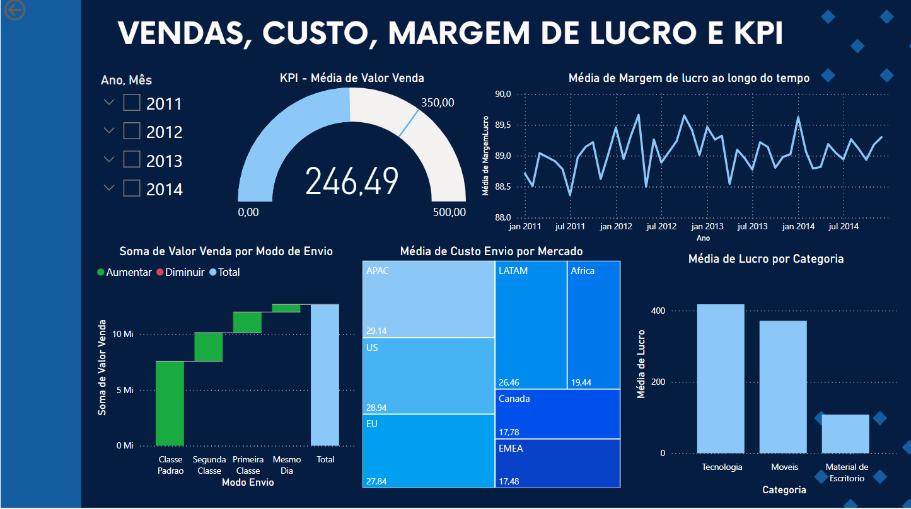

# 🚚 Dashboard de Vendas, Custo, Margem de Lucro e KPI | Power BI

> **Dashboard Interativo:** [Acesse Aqui](https://app.powerbi.com/view?r=eyJrIjoiNTRlZTg1ZmMtYWE4Yi00NjExLWJmNjQtM2NiMjAyYTgwNjg5IiwidCI6IjE5ZDk1YzVmLTkwOGMtNDdkYS05NTllLTdhMTk3ZjUyOGZmOSJ9)

---

## 📌 Sobre o Projeto

Este projeto apresenta um **Dashboard de Vendas, Custo, Margem de Lucro e KPI**, construído para analisar:
- **Vendas** (valor total e média) ao longo do tempo e por diferentes dimensões (modo de envio, mercados, categorias de produto).
- **Custos de Envio**, principalmente para identificar o custo médio por mercado.
- **Margem de Lucro** e **Lucro** (calculado como *valor de venda - custo de envio*).
- **KPI** (Indicador de Desempenho) para acompanhamento de meta de valor de venda por mês.

Projeto desenvolvido como parte do curso **Microsoft Power BI Para Business Intelligence e Data Science** da [Data Science Academy](https://www.datascienceacademy.com.br).

## 🔑 Perguntas de Negócio (Lab 2)

1. **Qual foi o total de valor de venda considerando cada modo de envio dos pedidos?**  
   

2. **Quais mercados tiveram o maior custo médio de envio dos produtos vendidos?**  
   

3. **A empresa tem como objetivo manter uma média de 350 para o valor de venda todos os meses. Ficou abaixo ou acima da meta em Abril/2014?**  
 
4. **Considerando que o lucro = valor de venda - custo de envio, qual categoria de produto apresentou maior lucro médio?**  
 

5. **Qual foi o comportamento da margem de lucro ao longo do tempo (lucro ÷ valor de venda)?**  
   

## 🛠️ Recursos e Visualizações

### 1. **KPI (Indicador) de Valor Médio de Venda**

### 2. **Gráfico de Linha: Margem de Lucro ao Longo do Tempo**

### 3. **Gráfico de Cascata: Valor de Venda por Modo de Envio**

### 4. **Gráfico Treemap: Custo Médio de Envio por Mercado**

### 5. **Gráfico de Barras: Lucro Médio por Categoria de Produto**

## 📊 Filtros e Interações

- **Seleção de Período (Ano/Mês)**: Permite analisar intervalos específicos (ex.: apenas 2014 para avaliar a meta mensal).
- **Filtragem por Modo de Envio ou Mercado**: Ao clicar em um modo de envio no gráfico de cascata ou em um bloco do treemap, os outros gráficos se atualizam automaticamente, mostrando dados relacionados.

